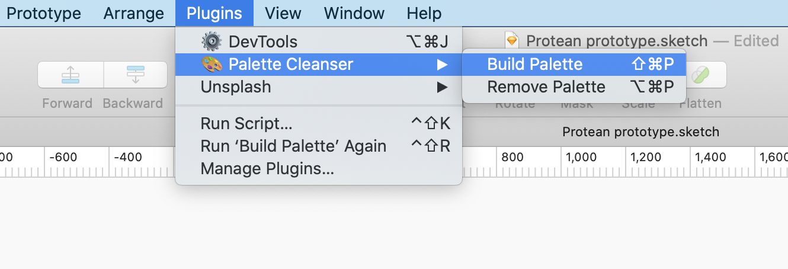
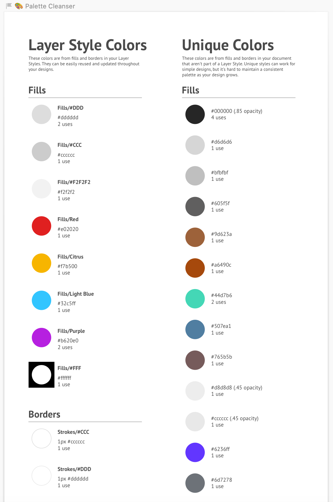

# Palette Cleanser

Get a full rundown of the colors you're using in your Sketch document. 

## Installation

- [Download](../../releases/latest/download/palette-cleanser.sketchplugin.zip) the latest release of the plugin
- Un-zip
- Double-click on palette-cleanser.sketchplugin

## Using Palette Cleanser

### Building your palette

To build your document palette, you can:

- Find 🎨 Palette Cleanser in the Sketch Plugins menu and select "Build Palette" 
- Press `⇧⌘P` (Shift-Command-P) on your keyboard

Either option will generate a new artboard called "🎨 Palette Cleanser" on the first page of your Sketch document (**please don't change the artboard name**). This artboard will show all the colors used in your current document, separated into 2 columns:

- **Layer Style Colors** are colors you've used from a defined [Layer Style](https://www.sketch.com/docs/styling/#layer-styles) in your document or a Sketch library. For each color, you'll see:
  - A swatch of the color
  - The Layer Style names where the color appears
  - The color's hex value and opacity
  - How many times the color is used in your document
- **Unique Colors**  are colors in your document that are *not* from a Layer Style. For each of these colors, you'll see:
  - A swatch of the color
  - The color's hex value and opacity
  - How many times the color is used in your document

### Updating your palette

Once you've built your palette, Palette Cleanser will automatically update the palette artboard when any color is changed, added, or removed from your document - no need to build again!

If your document colors get out of sync with Palette Cleanser, you can always run "Build Palette" again.

### Removing your palette

To remove the Palette Cleanser artboard, you can:
- Select "Remove Palette" from the 🎨Palette Cleanser in the Plugins menu
- Press `⌥⌘P` (Option-Command-P) on your keyboard

<!-- ## FAQ?

Should we put something here? -->

## Feedback

Open a Github issue or a pull request - feedback and improvements are always appreciated.

## Development Guide

This plugin was created using `skpm`. For a detailed explanation on how things work, checkout the [skpm Readme](https://github.com/skpm/skpm/blob/master/README.md).

